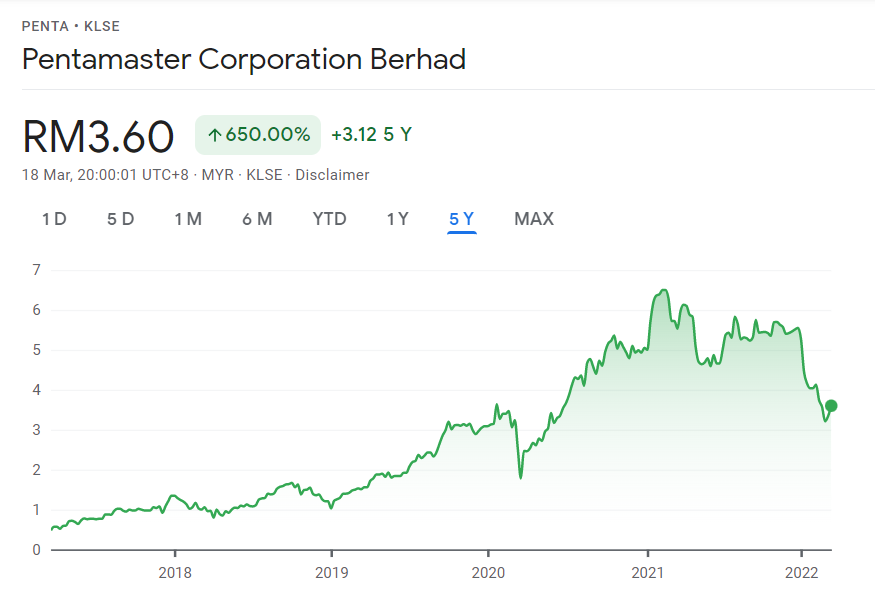
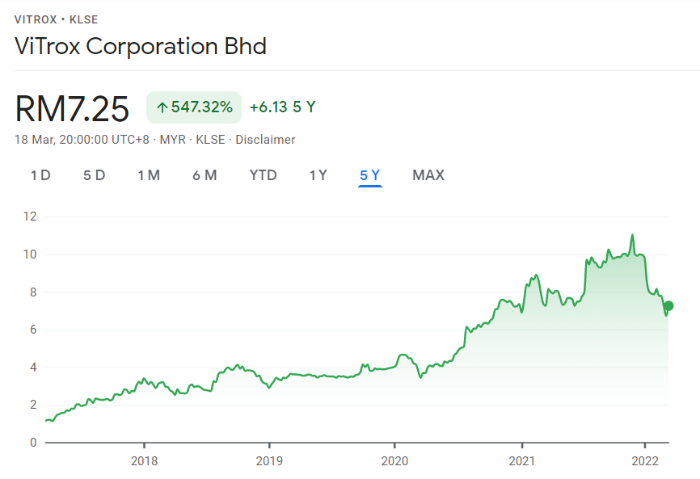

### Type your answer after every question. You are required to cite your reference for every question.

E.g. Question  
{Answer} {Reference}

1. What is the difference between private limited and public limited company? State one example for each type.

* A private limited company (Sendirian Berhad, Sdn Bhd in Malay) are usually small and medium SME where the company's shares are privately issued to individuals and/or corparate bodies up to a maximum of 50. A minimum of one director is required for this type of company in Malaysia. Examples are cafeteria company, printing/photocopy shops, franchisee and small construction company. 

* A public limited company (Berhad, Bhd in Malay) may or may not be publicly listed in the stock market such as KLSE in Malaysia, NASDAQ and/or NYSE in the United States. They can have unlimited number of shareholders and they must hold annual general meeting (AGM) with the shareholders. The minimum number of directors required in the company is two. Examples include major banks such as Maybank and Bank Islam, and telecommunication companies such as Maxis and Celcom

* References: [1](https://malayacorporate.com/article/the-difference-of-private-public-company/) [2](https://mishu.my/company-incorporation-and-formation/what-are-the-types-of-companies-in-malaysia/) [3](https://www.paulhypepage.my/public-limited-companies-in-malaysia/)

2. Why is Berjaya Sports Toto Berhad registered under Non-Shariah Compliant?

* Berjaya Sports Toto Berhad operates their business which is in the gambling (and betting) sector.

* References: [Managing Non-Syariah Compliant Money - MyGOV](https://www.malaysia.gov.my/portal/content/27678), [List of Non-Shariah Compliant Business Activities - Standered Chartered Saadiq](https://av.sc.com/my/content/docs/Non-Syariah-Compliant-Business-Activities_ref.pdf)

3. List down 3 Non-Shariah Compliant Business Activities. 

* Non-Shariah compliant business activites includes gambling, producing and selling non-halal goods (such as alcohol, pork and tobacco), and conventional insurance.

* References: [Managing Non-Syariah Compliant Money - MyGOV](https://www.malaysia.gov.my/portal/content/27678), [List of Non-Shariah Compliant Business Activities - Standered Chartered Saadiq](https://av.sc.com/my/content/docs/Non-Syariah-Compliant-Business-Activities_ref.pdf)

4. Name the stock exchange of Malaysia.

* [KLSE](https://www.bursamalaysia.com/)!

5. Create a new folder name 'AR' in your _repo main branch_. Upload Annual Report 2018 - 2020 for companies below:  
(a) ViTrox Corp  
(b) Pentamaster Corp   
*There should be at least 6 PDF files.  

* References: [ViTrox](https://www.vitrox.com/investor/annual-report.php), [Pentamaster](https://pentamaster.listedcompany.com/ar.html)

6. Who are the users of annual reports?

* For current shareholders and potential investors. With annual reports they are able to make decision such as buying more stocks or selling them depending on the situation of the company such as the increasing earnings.

* References: [1](https://www.inc.com/encyclopedia/annual-reports.html), [2](https://corporatefinanceinstitute.com/resources/knowledge/finance/annual-report/)

7. What is the most important part of an annual report?

* The key parts that most investors will focus on are the financial statement. They are able to judge by numbers to determine how the company progresses throughout the years. Others parts such as CEO's statement and the future outlook.

* References: [1](https://www.freshbooks.com/hub/reports/write-an-annual-report), [2](https://www.investopedia.com/articles/basics/10/efficiently-read-annual-report.asp), [3](https://corporatefinanceinstitute.com/resources/knowledge/finance/annual-report/)

8. You have RM 10,000 savings and want to purchase shares as an investment for earning side income. 
You have listed two potential companies and need to select one company to invest. 
Comparing _Pentamaster Corporation Bhd._ and _ViTrox Corporation Bhd._ Justify your investment choice.

* **Pentamaster** focuses on automation manufacturing and technology solutions provider while **Vitrox** focuses on design and manufacture of vision inspection equipment and embedded electronics devices. Both are **future-proof** in ways that they will not be phased out easily; and should it be phased out, they can rcontinue on with other similiar sectors.

* In 5 year period:
  * ViTrox's stocks increases from RM1.12 to RM7.25 up to **550%** increase in value.
  * Pentamaster's stocks increases from RM0.48 to RM3.60 up to **650%** increase in value.

* Because of the COVID-19 pandemic and the Malaysian political crisis, there are quite a few drops of stock value for both in the short term. In our case since investment is for long term it shouldn't be much of a problem.

* Comparing both compnay using Annual Report in 2020:
  * The earnings per share of ViTrox is **22.40sen** and **9.95sen** for Pentamaster.
  * The cash ratio (cash/liabilities) for Vitrox is **1.67** and for Pentamaster is **3.69**. Pentamaster have more cash to cover their debts in the short term.
  * The net income growth of ViTrox and Pentamaster is **32.60%** and **-14.64%** respectively. It should be noted that ViTrox's growth fell for 24.49% in the year 2019.
  * The P/E ratio of ViTrox and Pentamaster is **65.42** and **76.79** respectively. Both of them are quite similiar in value.

* As of 19/3/2022, the share price of ViTrox and Pentamaster is **RM7.25** and **RM3.60** respectively.

* In conclusion, both of them have similiar values in terms of their business sectors, financial situation and more. But most notably Pentamaster's are traded at a cheaper valuation with better cash ratio and long term growth. I would choose **Pentamaster** as my primary stock but it's better to diversify (preferably other sectors) and invests in suitable proportions to minimize risks.

* Referemces: [KLSE:PENTA - Google Trends](https://www.google.com/finance/quote/PENTA:KLSE), [KLSE:VITROX - Google Trends](https://www.google.com/finance/quote/VITROX:KLSE), [ValueInvestAsia](https://valueinvestasia.com/vitrox-corporation-berhad-vs-pentamaster-corporation-berhad/), [P/E 1](https://www.investopedia.com/terms/p/price-earningsratio.asp)

9. List down at least 2 investment resources (blogs/any media) that you found useful.

* [Kelvin Learns Investing](https://www.youtube.com/c/KelvinLearnsInvesting) - Super beginner friendly and straight to the point, based in Singapore
* [Ziet Invests](https://www.youtube.com/c/ZietInvests) - Many beginner friendly video for foreign investing such as IBKR, based more in Singapore but still can be applied in Malaysia
* [Mr Money TV](https://www.youtube.com/c/MrMoneyTV) - Discuss a lot about financial topics not only for investment and also focuses in Malaysia
* [Ringgit Freedom](https://ringgitfreedom.com/) - Contains many helpful resources and references for local investing in Malaysia
* If it's possible can you also share other's people recommendations as well? Thanks!

-- End --  
*Add 'Completed' as commit message after completing the assignment.
